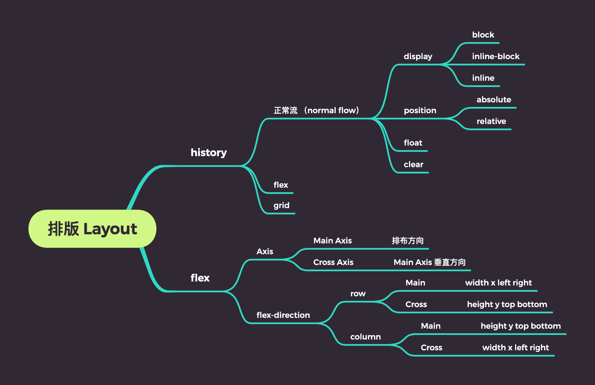
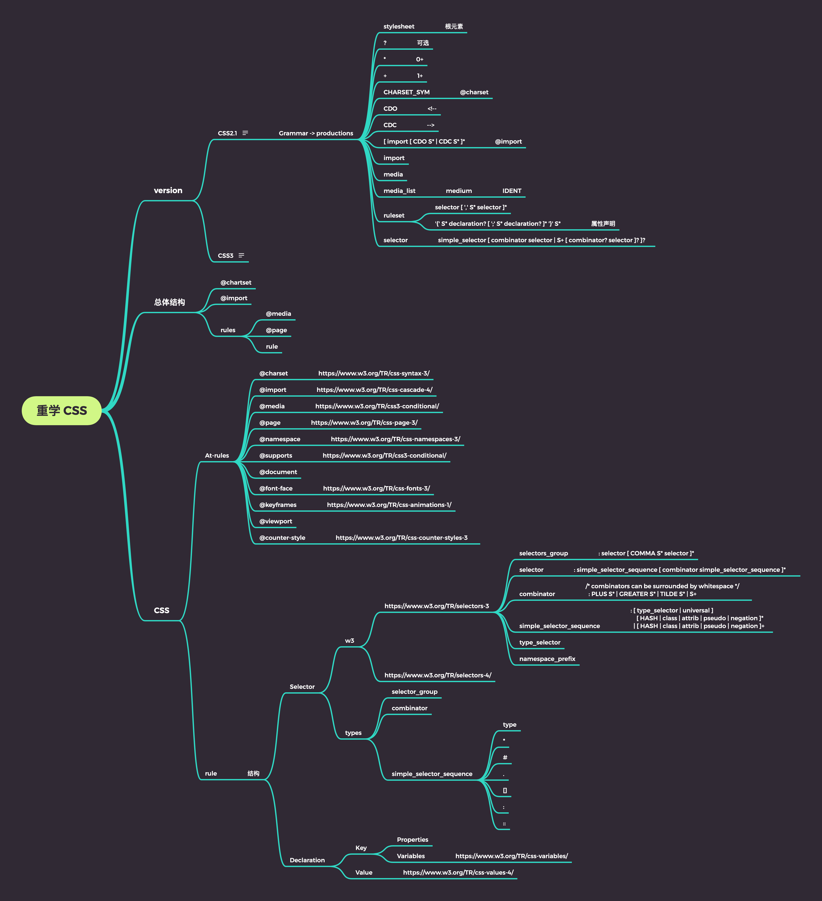
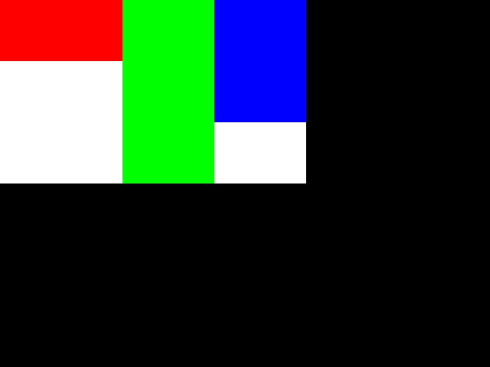

# Week07

## 课堂笔记及总结

### 0521


- [排版 Layout](./2020-05-21.md)
- 


### 0523

- [重学 CSS](./2020-05-23.md)
- 


## 习题


### toy browser


- [layout](./toy-browser/layout/index.js)
- [render](./toy-browser/render/index.js)

#### Code & Result

```html
<html>
  <head>
    <style>
      #container {
        width: 500px;
        height: 300px;
        display: flex;
        background-color: rgb(255,255,255);
      }

      #container #myid {
        width: 200px;
        height: 100px;
        background-color: rgb(255,0,0);
      }

      #container .c1 {
        flex: 1;
        background-color: rgb(0,255,0);
      }
      #container .c2 {
        width: 150px;
        height:200px;
        background-color: rgb(0,0,255);
      }
    </style>
  </head>
  <body>
    <div id="container">
      <div id="myid"></div>
      <div class="c1"></div>
      <div class="c2"></div>
    </div>
  </body>
</html>
```



### CSS 习题

- [css standards](./css_standards.json)
- [css crawler](./css_crawler.js)


