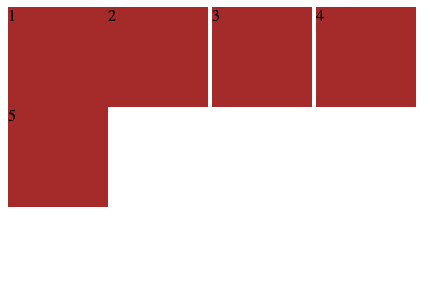

# CSS 排版

## 盒（Box）

### 概念

- 源代码 - 标签（Tag）
- 语义 - 元素（Element）
- 表现 - 盒（Box）

### 盒模型

- margin/border/padding/content
- box-sizing

	- content-box

		- width = content

	- border-box

		- width = border  + padding + content

## 正常流

### 排版

- 收集盒进行
- 计算盒在行中的排布
- 计算行的排布

### 排版细节

- 左 -> 右

	- 文字
	- inline-box

- 上 -> 下

	- line-box

		- 排满一行产生一个行盒，不对应任何元素
		- first-line 就是第一个 line-box 里面的内容
		- 将生成的行盒，当作虚拟元素

	- block-box

### IFC

- 概念

	- 本身占据的空间
	- 对齐方式（vertical-align）

		- baseline

			- Aligns the baseline of the element with the baseline of its parent

		- top/middle/bottom

			- Aligns the top of the element and its descendants with the top of the entire line
			- Aligns the bottom of the element and its descendants with the bottom of the entire line.
			- Aligns the middle of the element with the baseline plus half the x-height of the parent.

		- text-top/text-bottom

			- Aligns the top/bottom of the element with the top/bottom of the parent element's font.

		- sub/super

			- Aligns the baseline of the element with the subscript-baseline/superscript-baseline of its parent

	- 行高
	- 基线（baseline）
	- 文字上缘/下缘

- 知识点

	- 一个 inline-box 如果元素内没有文字，基线在元素盒下缘；有文字，最后一行文字的 baseline
	- 以行内最高的元素作为行高（设置的 line-height 要小于最高元素高度），并且保证最高元素的对齐方式正确

		- line-height 计算
先算上缘
再算下缘
再减去 text 高度
得到总高度

			- 计算行内每个元素上下缘撑开的高度
			- inline-block 元素，推荐使用 vertical-align: [top | middle | bottom]

	- 一个 inline-box 元素可能产生多个行盒

- display: inline-block;

	- 因换行符为合法字符，产生空白

		- 使用 float 模拟实现 inline-block

### 例子

[IFC.html](./demo/ifc/ifc.html)

[inline-block.html](./demo/ifc/inline-block.html)

### float 与 clear

- float

	- The float CSS property places an element on the left or right side of its container, allowing text and inline elements to wrap around it. The element is removed from the normal flow of the page, though still remaining a part of the flow

- clear

	- The clear CSS property sets whether an element must be moved below (cleared) floating elements that precede it. The clear property applies to floating and non-floating elements.

- 技巧

	- 使用 float 模拟实现 inline-block
	- 使用 float & clear 实现换行
	- float 元素 margin 不会重叠
	- float 会导致高度塌陷
	- float 会导致重排

		- 浏览器会依次 layout 元素，遇到 float 可能会使之前排好的元素位置发送变动等重排行为

### 例子

[float.html](./demo/float1/float.html)

[float1.html](./demo/float2/float1.html)

[float2.html](./demo/float2/float2.html)

[float3.html](./demo/float2/float3.html)

### BFC

- 概念

	- display

		- block/inline-block
		- flex/inline-flex

			- flex container/flex item
			- 子元素的 display 一定是 block(flex-item)，设置的 display 属性不会生效

		- table/inline-table
		- grid/inline-grid
		- inline
		- run-in

	- block container

		- 内部可容纳正常流
		- display: block/inline-block
		- flex items/table-cell

	- block-level box

		- 可放入正常流
		- display: flex/table/grid/block

	- block box

		- block-level boxes that are also block containers are called bock boxes

			- 内外都是 block

		- overflow 不是 visible

- bfc 合并（与父元素）

	- overflow: visible

- margin 折叠

	- margin = 留白
	- 只会发生在 BFC 中

		- 发生在 BFC 排版方向

### 例子

[bfc.html](./demo/bfc/bfc.html)

[margin.html](./demo/margin/margin.html)

## Flex

### 排版

- 收集盒进行
- 计算盒在主轴方向的排布
- 计算盒在交叉轴方向的排布

### 排版细节

- 分行

	- 根据主轴尺寸，把元素分进行
	- 若设置了 no-wrap ，强行分配进第一行

- 计算主轴方向

	- 找出所有 flex 元素
	- 把主轴方向的剩余尺寸按比例分配给这些元素
	- 若剩余空间为负数，所有 flex 元素为 0，等比压缩剩余元素

- 计算交叉轴方向

	- 根据每一行中最大元素尺寸计算行高
	- 根据行高 flex-align 和 item-align ，确定元素具体位置

### flex: [flex-grow, flex-shrink, flex-basis]

- 单值

	- 宽 / 高：flex-basis

		- 10em
		- 30px
		- auto
		- content

	- 无单位：flex-grow

		- 1
		- 2

- 两个值

	- flex-grow | flex-basis

		- 1 30px

	- flex-grow | flex-shrink

		- 1 1
		- 2 2

- 三个值

	- flex-grow | flex-shrink | flex-basis

		- 1 1 10%

- none

	- 0 0 auto

### 例子

[flex.html](./demo/flex/flex.html)

