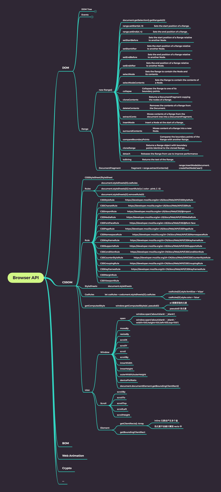

# Week10

## 课堂笔记及总结

### 0611

[Range, CSSOM](./2020-06-11.md)

- [reverse](./html/reverse.html)
- [range](./html/range.html)
- [scroll](./html/scroll.html)
- [stylesheet](./html/stylesheet.html)
- [cssom](./html/cssom.js)
- [apis](./html/apis.html)

### 0613

[Tic Tac Tao](./2020-06-13.md)

## 习题

- [apis](./apis.xmind)

- [TicTacTao](./TicTacToe/v3.html)
