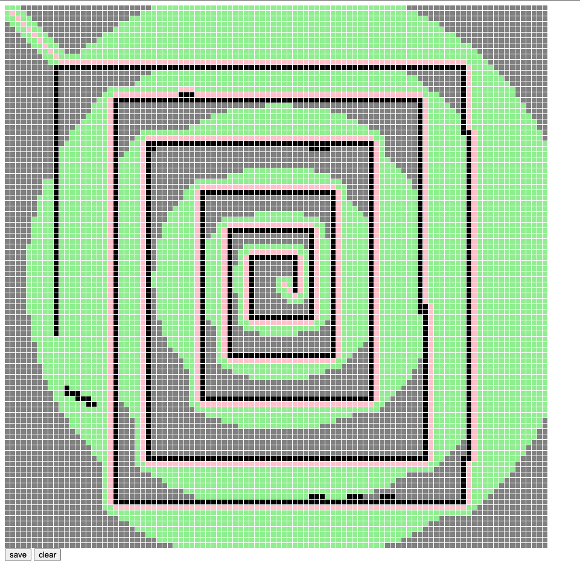

# 寻路问题（搜索）

[edit.html](./path/edit.html)
[init.js](./path/init.js)

- [v1.js](./path/v1.js)

- [v2.js](./path/v2.js)


- [v3.js](./path/v3.js)


- [v4.js](./path/v4.js)


- [v5.js](./path/v5.js)


- [v6.js](./path/v6.js)

```js
class Sorted {
  constructor(data, compare) {
    this.data = data
    this.compare = compare
  }

  take() {
    if (!this.data.length)
      return

    let min = this.data[0]
    let minIdx = 0

    for (let i = 1, l = this.data.length;i < l;i++) {
      if (this.compare(this.data[i], min) > 0) {
        min = this.data[i]
        minIdx = i
      }
    }

    this.data[minIdx] = this.data[this.data.length - 1]
    this.data.pop()
    return min
  }

  insert(val) {
    this.data.push(val)
  }

  get length() {
    return this.data.length
  }
}
```


- [v7.js](./path/v7.js)

```js
class BinaryHeap {
  // 数组模拟二叉堆
  constructor(data, compare) {
    this.data = data
    this.compare = compare
  }

  take() {
    if (!this.data.length)
      return

    let min = this.data[0]
    let idx = 0
    let len = this.data.length

    // fix heap
    while (idx < len) {
      if (idx * 2 + 1 >= len) break

      if (idx * 2 + 2 >= len) {
        this.data[idx] = this.data[idx * 2 + 1]
        idx = idx * 2 + 1
        break
      }

      if (this.compare(this.data[idx * 2 + 1], this.data[idx * 2 + 2]) < 0) {
        this.data[idx] = this.data[idx * 2 + 1]
        idx = idx * 2 + 1
      } else {
        this.data[idx] = this.data[idx * 2 + 2]
        idx = idx * 2 + 2
      }
    }

    if(idx < len - 1)
      this.insertAt(idx, this.data.pop())
    else
      this.data.pop()

    return min
  }

  insertAt(idx, val) {
    this.data[idx] = val
    while (idx > 0 && this.compare(val, this.data[Math.floor((idx - 1) / 2)]) < 0) {
      this.data[idx] = this.data[Math.floor((idx - 1) / 2)]
      this.data[Math.floor((idx - 1) / 2)] = val
      idx = Math.floor((idx - 1) / 2)
    }
  }

  insert(val) {
    this.insertAt(this.data.length, val)
  }

  get length() {
    return this.data.length
  }
}
```


