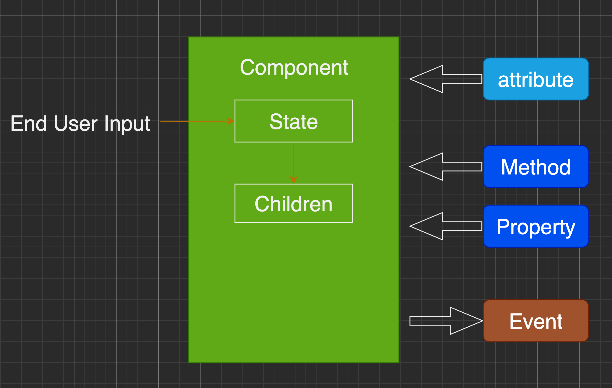
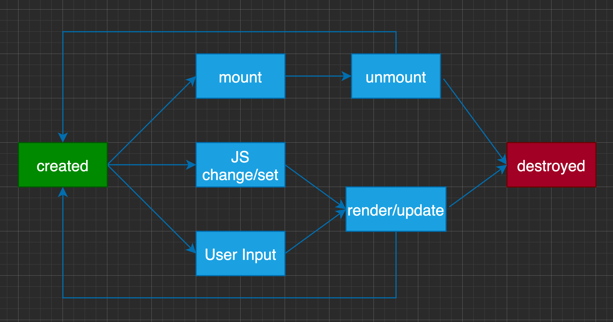

# 对象与组件

## 对象

- Properties
- Methods
- Inherit


## 组件

- Properties
- Methods
- Inherit
- Attribute
- Config & State
- Event
- Lifecycle
- Children



## Attribute vs Property

- Attribute 强调描述性
- Property 强调从属关系


- Attribute:

```
<my-component attribute="v" />

myComponent.getAttribute('a')
myComponent.setAttribute('a', 'val')
```

- Property:

```
myComponent.a = 'value'
```

```
<div class="cls1 cls2"></div>

<script>
var div = document.getElementsByTagName('div')[0]
div.className // cls1 cls2
</script>
```

```
<div class="cls1 cls2" style="color: blue;"></div>

<script>
var div = document.getElementsByTagName('div')[0]
div.style // 对象
</script>
```

```
<a href="//m.taobao.com" />

<script>
var a = document.getElementsByTagName('a')[0]
a.href  // "http://m.taobao.com", 这个 URL 是 resolve 后的结果
a.getAttribute('href')  // "//m.taobao.com", 和 HTML 中的代码完全一致
</script>
```

```
<input value="cute" />

<script>
var input = document.getElementsByTagName('input')[0]

input.value  // cute
input.getAttribute('value')  // cute

input.value = 'hello'
input.value  // hello
input.getAttribute('value')  // cute
</script>
```

[MyComponent](./Components/MyComponent.js)


## Lifecycle




## 如何设计组件状态


|           | Markup set | JS set | JS change | User Input Change |
| :-------: | :--------: | :----: | :-------: | :---------------: |
| property  |     ❌      |   ⭕️    |     ⭕️     |         ❓         |
| attribute |     ⭕️      |   ⭕️    |     ⭕️     |         ❓         |
|   state   |     ❌      |   ❌    |     ❌     |         ⭕️         |
|  config   |     ❌      |   ⭕️    |     ❌     |         ❌         |


## Children


- Content 型 children 与 Template 型 children


```
<my-button>{{title}}</my-button>

<my-list>
	<li>{{title}}</li>
</my-list>
```


