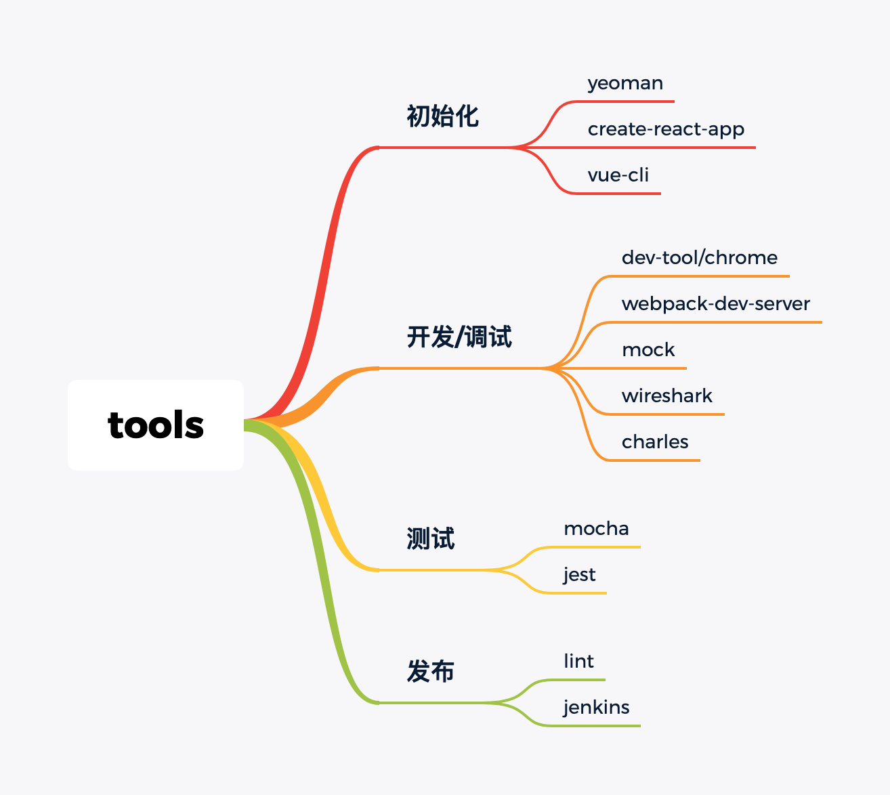

# 工具

- jenkins

- git

- webpack

- travis

- babel

- eslint

- gulp

- create-react-app

- umi

- gitlab

- vscode

- mocha

- http-server

- rollup

- vue-cli

- grunt

- mock

- husky

- prettier

- axios

- yeoman

- postman

- dva

- lerna

- jest

- easemock

- swagger

- wireshark

  

